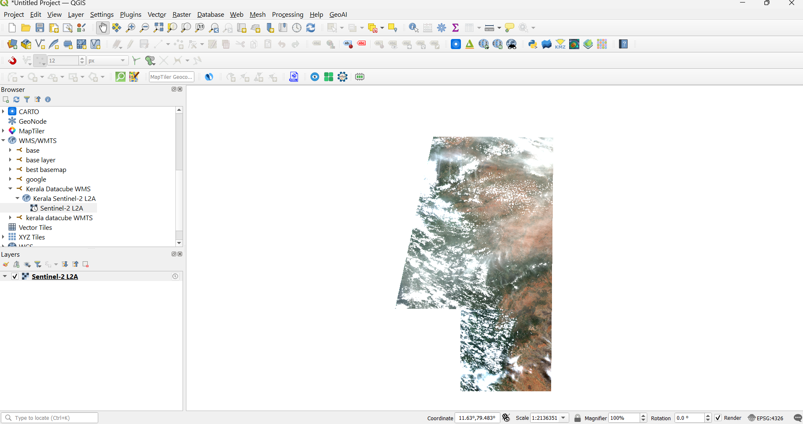

# Kerala Open Data Cube

## Overview

This repository documents the process of building a local Open Data Cube (ODC) environment for Earth Observation data analysis over the Kerala region, using open-source geospatial technologies. Rather than being a copy of the Open Data Cube source code, it captures the workflow, configuration, and lessons learned while setting up and running a local data cube — including OGC web service (WMS/WMTS/WCS) configuration via `datacube-ows`.

## Project Highlights

- Built and configured a local Open Data Cube environment on Linux (WSL)
- Indexed Sentinel-2 Level-2A COG data (7,772 datasets, ~64,965 km², EPSG:32643) from the Element 84 `sentinel-s2-l2a-cogs` AWS S3 bucket, using a parallelized bulk-indexing script (GNU parallel)
- Configured `datacube-ows` to serve the indexed data via WMS, WMTS, and WCS
- Configured and used Datacube Explorer

## Screenshots

**Datacube Explorer — sentinel_2_l2a collection summary**

**Sentinel-2 imagery served via WMS, rendered in QGIS**

**Sentinel-2 imagery served via WMTS, rendered in QGIS**

## Technologies

- Open Data Cube
- datacube-ows
- Python
- Dask
- PostgreSQL
- Linux (WSL)
- GNU parallel
- Jupyter Notebook
- GDAL
- Cloud Optimized GeoTIFF (COG)

## Status

🚧 This repository is actively being documented and organized. Notebooks and additional workflow documentation will be added progressively.

## Setup

For details on the local environment configuration (conda environment, datacube-ows setup, environment variables), see [setup_notes.md](setup_notes.md).
